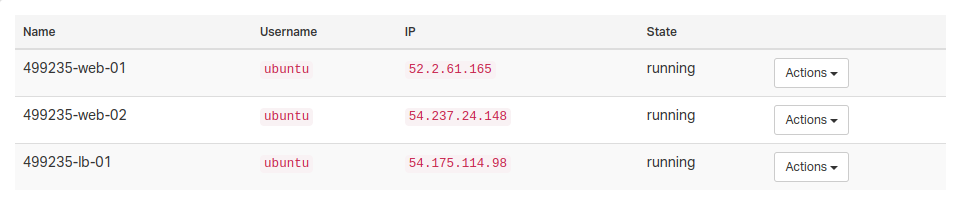

# 0x0F. Load balancer

## Background Context
You have been given 2 additional servers:

- gc-[STUDENT_ID]-web-02-XXXXXXXXXX
- gc-[STUDENT_ID]-lb-01-XXXXXXXXXX
Let’s improve our web stack so that there is [redundancy](https://en.wikipedia.org/wiki/Redundancy_%28engineering%29) for our web servers. This will allow us to be able to accept more traffic by doubling the number of web servers, and to make our infrastructure more reliable. If one web server fails, we will still have a second one to handle requests.

For this project, you will need to write Bash scripts to automate your work. All scripts must be designed to configure a brand new Ubuntu server to match the task requirements.
## Servers

## Tasks
## Resources
- [Introduction to load-balancing and HAproxy](https://www.digitalocean.com/community/tutorials/an-introduction-to-haproxy-and-load-balancing-concepts)
- [HTTP header](https://www.techopedia.com/definition/27178/http-header)
- [Debian/Ubuntu HAProxy packages](https://haproxy.debian.net/#distribution=Ubuntu&release=jammy&version=3.0)
