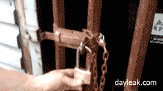

# 0x10. HTTPS SSL

## Background Context
What happens when you don’t secure your website traffic?

## Tasks
## Resources
- [What is HTTPS?](https://www.instantssl.com/http-vs-https)
- [What are the 2 main elements that SSL is providing]()
- [HAProxy SSL termination on Ubuntu16.04]()
- [SSL termination]()
- [Bash function]()
